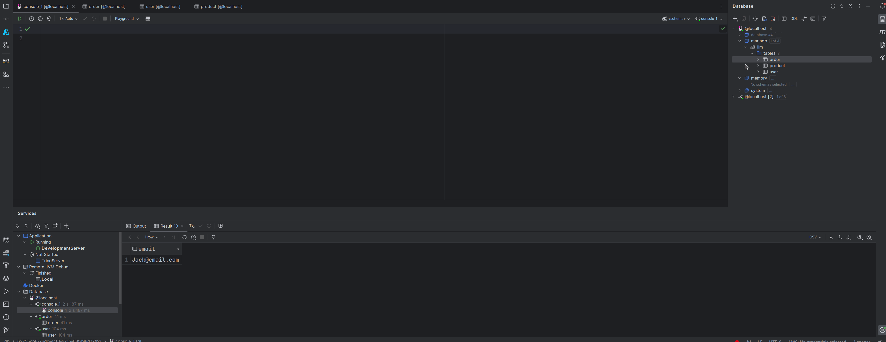

## Getting started
This project integrate trino with OpenAI using [langchain4j](https://github.com/langchain4j/langchain4j) to support nature language. 
This is done on the trino server side meaning that it is compatible with existing tools which use the [Trino client REST API](https://trino.io/docs/current/develop/client-protocol.html), like IDE, Superset and JDBC client.
To get started:

1. Config a mariadb catalog and create a llm schema.
2. Config your openai secret key with environment variable _openai_api_key_.
3. Follow the [doc](https://github.com/trinodb/trino#running-trino-in-your-ide) to run trino on local.
4. Connect trino with any IDE that uses trino jdbc, and execute SQL or questing using natural language as below: 

